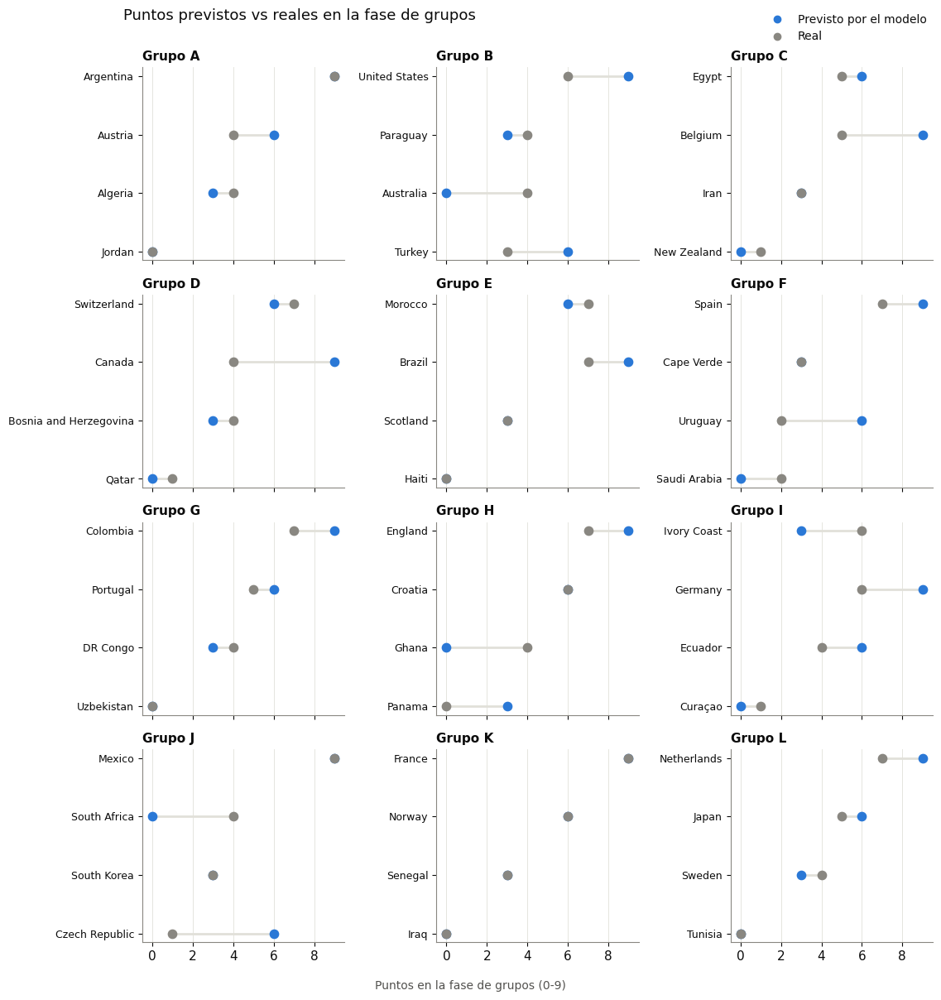
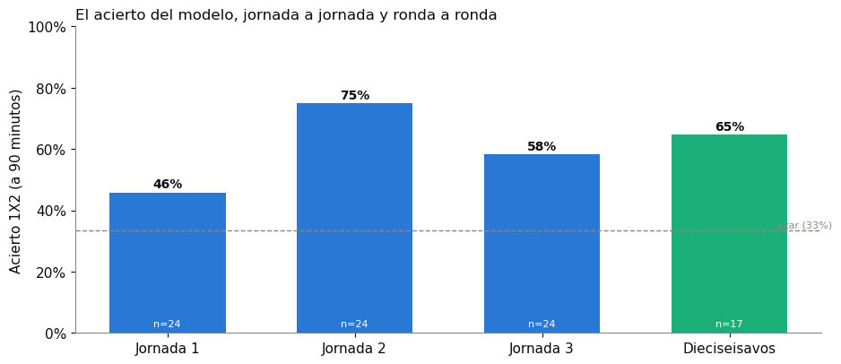
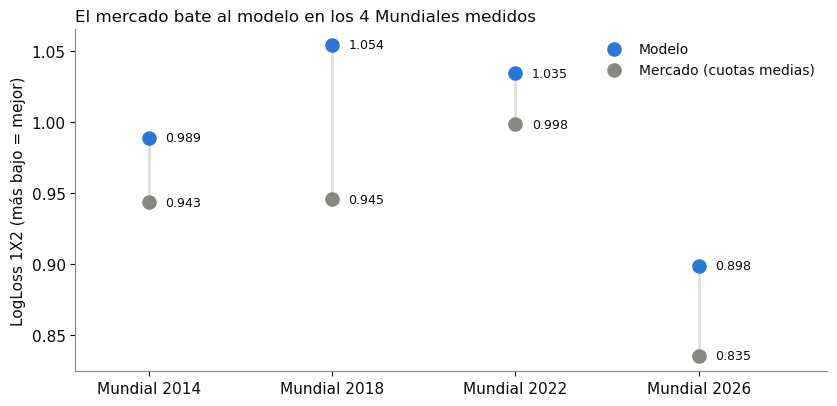

# WC 2026 Match Predictor

**Predicción probabilística del Mundial 2026 de principio a fin**: marcador exacto, 1X2,
quién avanza en cada eliminatoria (y si se decide en 90', prórroga o penaltis), simulación
Montecarlo del cuadro completo, y un benchmark honesto contra las cuotas reales del mercado
de apuestas. Todo validado con backtesting walk-forward sin fuga temporal sobre 36 años de
fútbol internacional.

> **EN — TL;DR**: End-to-end ML system predicting the 2026 World Cup — dual-Poisson goal
> models (XGBoost) with Dixon-Coles correction, isotonic calibration, walk-forward
> retraining, empirical extra-time/penalties module, and Monte Carlo bracket simulation.
> Every modeling decision is backed by leak-free backtests over **82 major-tournament
> editions (2,677 matches, 1990-2026)**; the model is also benchmarked against real
> closing odds from 4 World Cups — and the repo reports honestly that the market wins.
> Built with pandas, scikit-learn, XGBoost/LightGBM, Optuna and matplotlib.

## Resultados clave

| Métrica (evaluación a ciegas, sin fuga temporal) | Resultado |
|---|---|
| Acierto 1X2 en la fase de grupos 2026 (72 partidos) | **60%** (azar: 33%, casas de apuestas: ~55-58%) |
| Acierto de quién avanza, dieciseisavos 2026 | **12/12** de los cruces decididos en 90' |
| Marcador exacto (5 Mundiales, tras el ajuste de contexto) | **12.1%** (top-3: 36%) |
| Accuracy 1X2 sobre 82 ediciones de torneos mayores | **54.3%** |
| Puntos exactos de grupo clavados por selección (2026) | 15/48, error medio 1.5 pts |





## Qué demuestra este proyecto (más allá del fútbol)

- **Disciplina anti-fuga**: cada evaluación entrena solo con datos anteriores al partido
  evaluado; el walk-forward reproduce exactamente lo que se sabía en cada momento.
- **Decisiones por evidencia, con registro**: cada feature o cambio de modelo se adoptó o
  descartó con un backtest amplio documentado (Notebook 3 mantiene el registro completo,
  incluidos los descartes — que son la mayoría).
- **Honestidad frente al benchmark más duro**: comparado contra cuotas de cierre reales,
  el mercado gana — y el repo lo publica con los datos en vez de esconderlo, junto a una
  estrategia de apuestas condicional que dice cuándo NO apostar
  ([`docs/estrategia_apuestas.md`](docs/estrategia_apuestas.md)).



---

Sistema de predicción de resultados del Mundial 2026. La idea central: en vez de predecir
directamente "quién gana", se modelan los **goles de cada lado por separado** (dos procesos
de Poisson, local y visitante), con una corrección (Dixon-Coles) para el hecho de que los
marcadores bajos (0-0, 1-0, 0-1, 1-1) ocurren algo más de lo que la independencia pura
predice. De ahí se derivan todas las demás preguntas — quién gana, empate, marcador
probable, quién avanza en un cruce eliminatorio — como consecuencia matemática de esas dos
distribuciones.

El modelo nunca ve el resultado de una ronda antes de predecirla: cada ronda se evalúa "a
ciegas" y **solo después** se incorpora su resultado real para la siguiente (reentrenamiento
walk-forward), guardando un snapshot (`models/checkpoints/`) en cada etapa del torneo.

## El pipeline en 5 notebooks

| # | Notebook | Qué hace | ¿Cuándo se ejecuta? |
|---|---|---|---|
| 1 | [`01_adquisicion_datos.ipynb`](notebooks/01_adquisicion_datos.ipynb) | Descarga los resultados históricos y el Elo de cada selección | Para traer resultados nuevos |
| 2 | [`02_limpieza_y_eda.ipynb`](notebooks/02_limpieza_y_eda.ipynb) | Limpia, cruza fuentes, construye todas las features (Elo, forma, H2H, palmarés reciente, rendimiento vs rivales top), y valida los supuestos estadísticos antes de modelar | Después del 1 |
| 3 | [`03_eleccion_modelo.ipynb`](notebooks/03_eleccion_modelo.ipynb) | Compara familias de modelo (GLM/LightGBM/XGBoost) contra 5 Mundiales pasados, no solo contra 2026 — y mantiene el registro de qué mejoras se probaron, con qué evidencia, y cuáles se adoptaron o descartaron | Rara vez — solo para reconfirmar qué familia usar |
| 4 | [`04_prediccion.ipynb`](notebooks/04_prediccion.ipynb) | Entrena, predice partido a partido con reentrenamiento walk-forward (diario en fase de grupos, por ronda en eliminatorias), aplica el ajuste de contexto de Mundial a las lambdas, descompone cada cruce en P(90'/prórroga/penaltis), y simula el cuadro completo por Montecarlo (día 0 o con lo jugado hasta hoy) | Cada vez que hay resultados nuevos |
| 5 | [`05_cuadro_final.ipynb`](notebooks/05_cuadro_final.ipynb) | Cuadro visual (bracket) con banderas, real donde ya se jugó y predicho en cascada el resto | Después del 4 |

Aparte del pipeline (1-5), [`06_resumen_visual_portfolio.ipynb`](notebooks/06_resumen_visual_portfolio.ipynb)
es un recorrido visual completo del proyecto — datos, limpieza, features, estandarización,
EDA, comparación de modelos, calibración, precisión real, predicciones partido a partido de
fase de grupos, clasificación prevista vs. real de cada grupo, el cuadro eliminatorio
completo y probabilidades por selección — pensado para mostrar el proyecto de principio a
fin (portfolio / Kaggle). Autocontenido: solo lee de `data/` y `results/`, no depende de que
se acabe de ejecutar nada; para subirlo a Kaggle basta con adjuntar esas carpetas como
dataset y ajustar `DIR_DATOS` en la primera celda.

## La receta: qué ejecutar para cada cosa

**Actualizar la base de datos** (traer resultados nuevos):
1. Ejecuta el **Notebook 1** — siempre vuelve a descargar todo desde cero (no hace falta que
   distinga qué ya tenías, no tarda). Descarga tanto el mirror histórico (1.1) como el
   calendario del Mundial 2026 (1.5, desde `openfootball/worldcup.json`), que sí incluye
   prórroga y penaltis — algo que el mirror histórico nunca captura (solo guarda el marcador
   de los 90 minutos). Si un partido recién jugado aún no aparece en ninguna de las dos
   fuentes públicas (les puede tomar horas), añádelo a mano en
   `data/raw/wc2026_calendario.json` con su `score.ft` (y `et`/`p` si se decidió en
   prórroga/penaltis) antes de re-ejecutar el Notebook 1.
2. Ejecuta el **Notebook 2** para reconstruir las features con los datos frescos.

**Obtener predicciones nuevas** (con los resultados ya jugados incorporados):
1. Ejecuta el **Notebook 4** — detecta qué rondas nuevas hay jugadas, evalúa la predicción que
   ya se había hecho para ellas (sin tocarla a posteriori) y **entonces** reentrena antes de
   predecir la siguiente ronda. Esto ES el reentrenamiento — no hace falta ningún paso aparte
   para "reentrenar".
2. Ejecuta el **Notebook 5** para ver el cuadro/bracket actualizado con los resultados nuevos.

**Ver las probabilidades de cada selección, actualizadas con lo jugado hasta hoy**:
- Dentro del Notebook 4, sección "Simulación Montecarlo": pon `ETAPA_SIMULACION = "actual"` y
  ejecuta desde ahí — no hace falta repetir todo el notebook. Da la probabilidad de cada
  selección de llegar a octavos/cuartos/semis/ser campeona, con todo lo jugado hasta hoy ya
  metido dentro. Si en cambio pones `ETAPA_SIMULACION = "pre_mundial"`, ves la misma vista pero
  congelada el día antes de empezar el torneo — útil para comparar "qué se esperaba" contra lo
  que pasó de verdad.

**¿Y si cambio de modelo?**: el Notebook 3 es el que decide, con evidencia (backtesting contra
2010/2014/2018/2022), qué familia usar — está pensado para ejecutarse rara vez, solo si quieres
reconfirmar la elección. Si su conclusión cambia, el Notebook 4 hoy fuerza la familia ganadora
a mano en su sección de selección de modelo (comentado el porqué ahí mismo).

## Qué se ha validado (y qué se ha descartado) — el registro completo vive en el Notebook 3

Toda mejora se decide con el mismo estándar: backtest de 5 Mundiales (2010-2026, entrenando
cada vez solo con lo anterior al torneo) y, si es decisiva, verificación sobre **82 ediciones
de los 7 torneos mayores desde 1990 (2.677 partidos)**. Adoptadas: features de palmarés
reciente (LogLoss 0.975→0.974, accuracy 54.0%→54.3% en las 82 ediciones), ajuste de contexto
de Mundial sobre las lambdas (marcador exacto 10.1%→12.1% en 5 Mundiales), calibración
isotónica, y el módulo empírico de prórroga/penaltis (33%/67% si hay empate a 90', logística
por Elo en prórroga, penaltis 50/50 — `results/params_eliminatorias.json`, derivado con `scripts/derivar_desenlaces_eliminatorias.py` de 296
cruces reales), y el **valor de mercado histórico de la plantilla** (dataset de Kaggle
`davidcariboo/player-scores`, verificado sobre 33 ediciones 2010-2026: RMSE 1.1552→1.1419,
LogLoss 0.9695→0.9576, marcador exacto 14.8%→15.3% — la evidencia agregada más consistente
de todas las features probadas). Descartadas con evidencia: features de SofaScore, decaimiento
exponencial de forma, recalibración de marcadores frecuentes, y la regla de umbral para
predecir empates.

## Módulo de apuestas (`scripts/simulador_kelly.py`)

Compara las probabilidades del modelo con cuotas reales de mercado (football-data.co.uk,
Mundiales 2014-2026), detecta apuestas de valor (edge = p·cuota − 1) y simula una banca con
Kelly fraccionado (`--banca`, `--kelly`, `--umbral-edge`). **El veredicto medido es que NO hay
edge**: las cuotas de cierre baten al modelo en LogLoss en los 4 Mundiales
(`results/apuestas_benchmark_mercado.csv`) y apostar el edge aparente pierde ~80% de la banca
(`results/apuestas_historial_kelly.csv`). El módulo existe precisamente para medir eso — y su
aviso de "mercado mejor calibrado que el modelo" se dispara correctamente antes de simular.

## Estructura del repositorio

```
data/
  raw/                      # results.csv, elo_historico.csv, wc2026_calendario.json (los 3 se
                             # descargan solos con el Notebook 1)
  processed/                # partidos_features.csv -- se regenera, no va en git
results/
  predicciones_*.csv        # predicciones partido a partido (SÍ va en git -- es el resultado final)
  comparacion_modelos.csv   # comparación de familias, 5 Mundiales
  simulacion_probabilidades_*.csv  # Montecarlo, "pre_mundial" y/o "actual"
  cuadro_completo.csv, bracket.html  # el cuadro visual
  experimento_*.csv         # evidencia de cada mejora probada (adoptada o no)
  verificacion_70ediciones.csv     # la verificación al estándar más amplio (82 ediciones)
  apuestas_*.csv            # benchmark contra cuotas reales + historial Kelly
models/
  checkpoints/<etapa>/      # snapshot del modelo en cada punto del torneo
  modelo_goles_*.joblib     # estado "actual" (el más reciente)
  params_eliminatorias.json # módulo prórroga/penaltis (parámetros empíricos)
notebooks/
  01_adquisicion_datos.ipynb ... 05_cuadro_final.ipynb   # el pipeline
  06_resumen_visual_portfolio.ipynb                       # el recorrido visual (Kaggle)
scripts/
  simulador_kelly.py        # módulo de apuestas: edge + Kelly + simulación de banca
  scrape_sofascore*.py      # scrapers de estadísticas avanzadas (feature descartada, se
                             # conservan como documentación del experimento)
  scrape_transfermarkt_valor.py  # valor de mercado actual (evidencia insuficiente, ídem)
logs/                       # logs de scraping (no van en git)
tests/
  test_pipeline.py          # funciones puras extraídas de los notebooks (sin reimplementar)
requirements.txt
```

`data/` y `models/` están en `.gitignore` (se regeneran ejecutando los notebooks). `results/`
**sí** va en git: es el resultado final, no un paso intermedio.

## Cómo ejecutar

```
pip install -r requirements.txt
```

Para ejecutar un notebook de principio a fin desde la terminal (sin abrir Jupyter):

```
jupyter nbconvert --to notebook --execute --inplace notebooks/01_adquisicion_datos.ipynb
```

## Tests

```
pytest tests/
```

Cubren las funciones más delicadas (extraídas en caliente de los propios notebooks, sin
reimplementar): la moda correcta de una Poisson (y su matiz con la moda del marcador
*conjunto* cuando hay correlación de Dixon-Coles), que la decisión de quién avanza en un
cruce sea siempre por probabilidad y no por marcador puntual, que el `rho` de Dixon-Coles
se quede cerca de 0 con datos independientes, y la normalización local/visitante del JSON
del Mundial.

## Estado actual (última ejecución)

- Familia de modelo en producción: revisar `models/metadata.json` (`familia`).
- Campeón previsto: `results/cuadro_completo.csv`, partido 104 (Final).
- Probabilidades por selección: `results/simulacion_probabilidades_actual.csv`.
